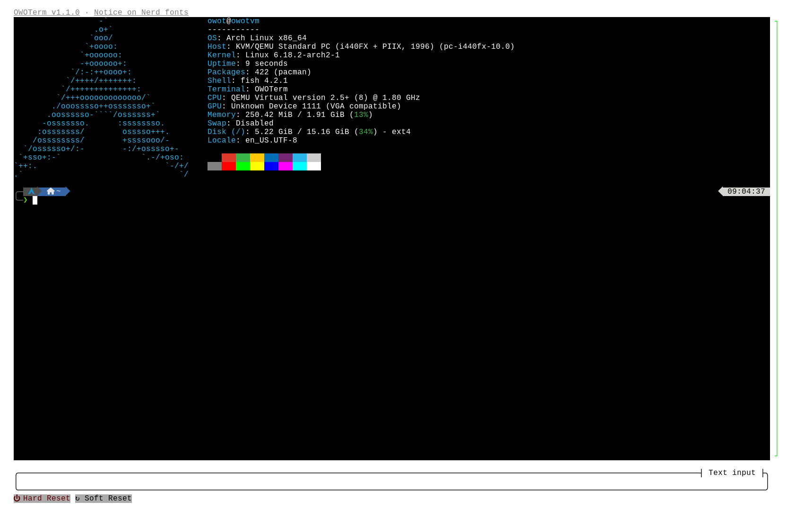
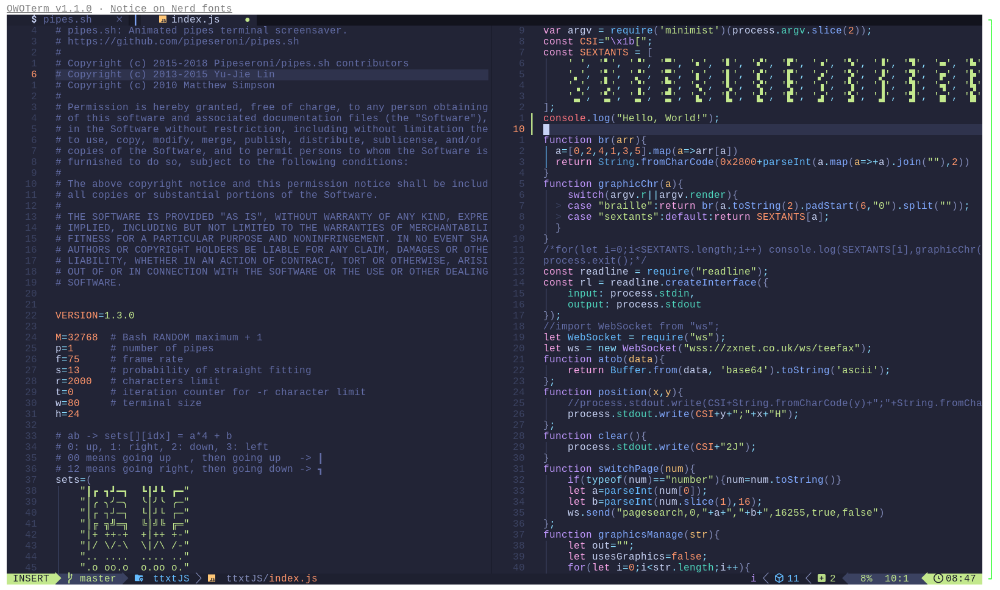
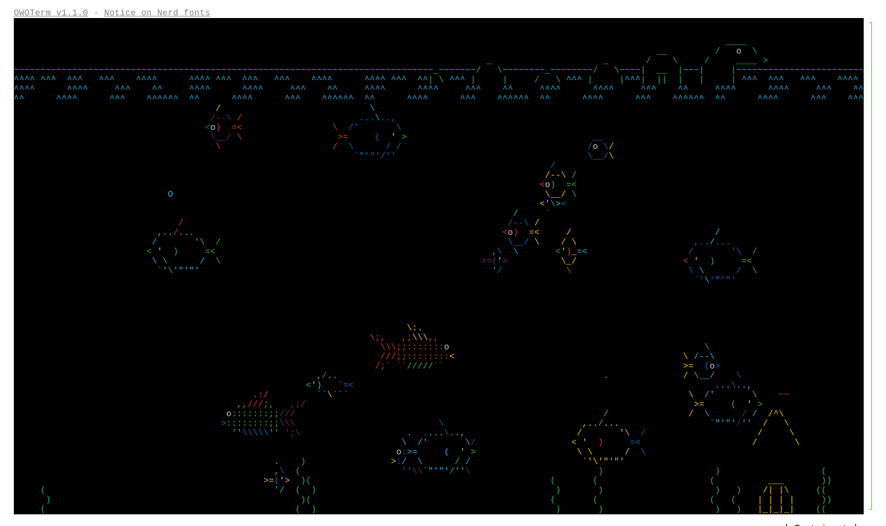
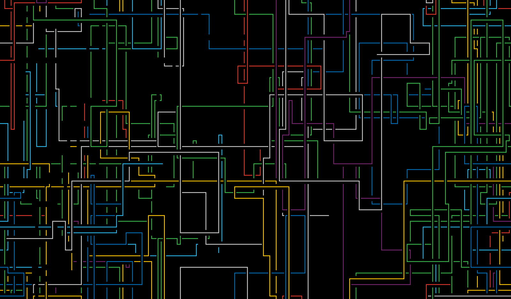
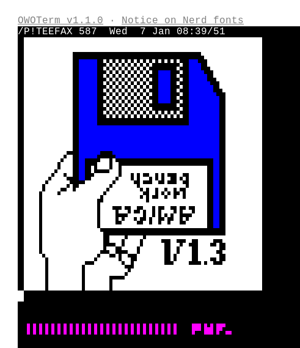
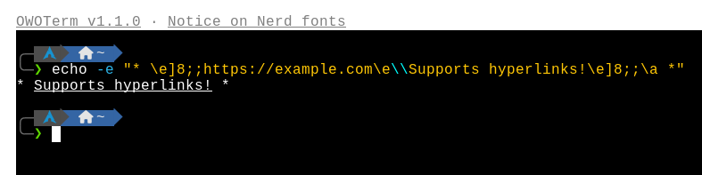
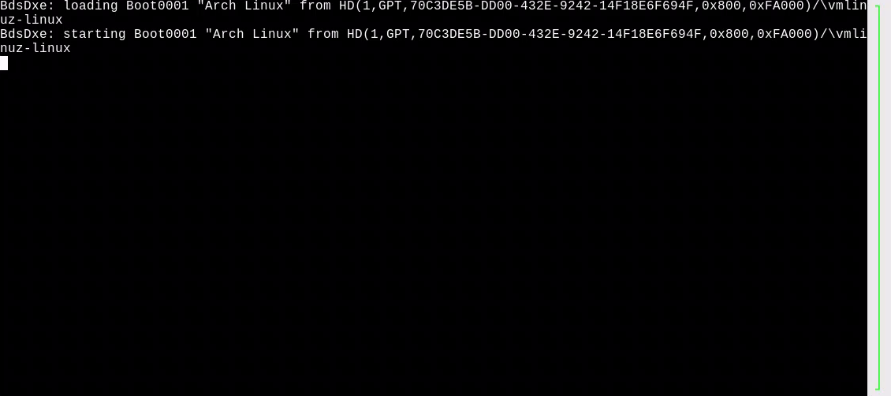

# OWOTerm

This is a terminal emulator for the [Our World of Text](https://ourworldoftext.com) website, with support for QEMU virtual machine control ([QMP](https://wiki.qemu.org/Documentation/QMP)), controlling through chat, an interactable text input dialog and power buttons.



|  |  |
|---|---|
|  |  |


As of version v1.1.0, OWOTerm started supporting hyperlinks:



## Notice on Nerd fonts
Some programs like the Fish shell on the [Tide theme](https://github.com/IlanCosman/tide), or [Neovim](https://neovim.io/) paired with [Lazyvim](https://www.lazyvim.org/), use characters that are only available on a [Nerd font](https://www.nerdfonts.com/): they are supposed to be icons, but inside of vanilla OWOT, they will show up as if it was an invalid character (most likely a [tofu](https://fonts.google.com/knowledge/glossary/tofu), e.g. empty box, or a box with the character's code point in Linux).

This is only a problem with OWOT, not OWOTerm. The character code points are the same as in the terminal app's output, and OWOTerm has full Unicode support though [stringz](https://www.npmjs.com/package/stringz).

---

In order to fix these characters from displaying incorrectly, you'll first need to [install a pre-packaged nerd font](https://www.nerdfonts.com/font-downloads) on your computer. The font you will choose doesn't matter, since any one of them should have all the icons. Afterwards, you will need to load the font in OWOT, by going to the DevTools console (press Ctrl+Shift+I, then go to the Console tab in the new window). Inside the console, paste this:
```
w.changeFont(fontTemplate+", 'Hack Nerd Font'")
```
then replace `Hack Nerd Font` with the name of the nerd font that you have installed.

If you don't want to open the DevTools console everytime you open OWOT, you can automate it through [Tampermonkey](https://www.tampermonkey.net/). Create a new script, set `@match` to `https://ourworldoftext.com/*`, then replace `// Your code here...` with the code that you would normally insert in DevTools. Then click on File -> Save (or press Ctrl-S), and everything should be set up normally.

## Setting up

To add a terminal to your OWOT world, you will first need to find an empty rectangular area, and get the X and Y positions of the top left corner, and the width and height of that area.

Create a shell script in your computer that will run a QEMU virtual machine, and allow communicating through serial using standard input and output (`-nographic -serial stdio`). For example:
```
cd "/home/ponali/Documents/QEMU VMs/owot/"
qemu-system-amd64 -enable-kvm \
    -bios /usr/share/qemu/OVMF.fd \
    -m 2G \
    -smp $(nproc) \
    -hdb owot.img \
    -qmp tcp:localhost:4445,server,wait=off \
    -nographic -serial stdio
```

Go to this repository's [Releases page](https://github.com/Ponali/owoterm/releases), download an archive of the source code for the latest version, and extract it somewhere. Open your terminal and run `npm install` inside the new directory. Then edit the `settings.json5` file:

- In "World settings", change `world` to the name of the world, and `offsetX` and `offsetY` to the X and Y values of the position of the terminal in the world respectively.
- If you would like the Text input dialog or the power buttons to not show up, change `enableTextInputDialog` and `enablePowerButtons` to be `false`.
- In "Terminal settings", change `width` and `height` to the width and height of the terminal respectively. Keep in mind that the program will take 5 more characters in height for the Text input dialog, and for the "Hard Reset" and "Soft Reset" buttons, unless you have it disabled.
- In "QEMU VM", change `runExec` to the location of the shell script on your computer. If you set up QMP through a TCP port, change `qmpPort` to the number of said port.

QMP access is required in order to find the QEMU process and kill it in order to hard reset, and also communicate to QEMU directly in order to soft reset (equivalent of pressing the power button on any ACPI-capable machine.)

You will need to create a `token.txt` file with the token string in order to log in and access a world that only registered users can edit. If you would like to name your file something else, make sure you have updated the `token` entry in `settings.json5`.

After all of these steps, you should normally be able to run OWOTerm by running `node index` in the project directory.

If you would like to rename the settings file, make sure you run the program by running `node index [settingsFile]` instead.

## Definition of "loopscrolling"

You might see a lot of mentions of "loopscrolling" in the source code, or the config file (`settings.json5`).
Scrolling normally, i.e. copying the entire buffer one line higher, is slow and may be heavily impacted by desyncs. With loopscrolling enabled, the buffer will only be copied internally, but won't be updated in OWOT. The cursor will move to the top of the terminal canvas, then move down, and loop back up if it scrolls far enough. This is particularily helpful for cases where huge amounts of scrolling are required, like systemd logs.

| Loopscrolling enabled | Loopscrolling disabled |
| --------------------- | ---------------------- |
|  |  |
| Instead of copying every line in the canvas, it moves and tiles the buffer on the canvas, causing this looping effect. Since it doesn't have to re-draw the lines this way, it is much more faster. | Every line from the canvas is copied when the terminal scrolls, and due to the many requests it sends to the server, it desyncs, and needs manual request from the user to reload the terminal (`term:rl`). |
| OWOTerm shows the Arch boot logs much faster, and is able to show the fish shell the terminal resolution. | OWOTerm is not fast enough to show the terminal resolution to the fish shell, due to fish's request being far back in the buffer due to the systemd logs. Because of this, the shell throws an error and assumes the terminal's resolution uses 80 columns. |

The loopscrolling effect is only temporary. If the currently opened program or shell doesn't send anything to OWOTerm for 1 second (configurable with `loopscrollResetTimeout`), the terminal will reload and show the lines in the correct order.

Please note that loopscrolling will not occur when the program sets a custom scrolling margin (which is most likely a text editor), loopscrolling will not occur, regardless of the `loopscrolling` config setting.
